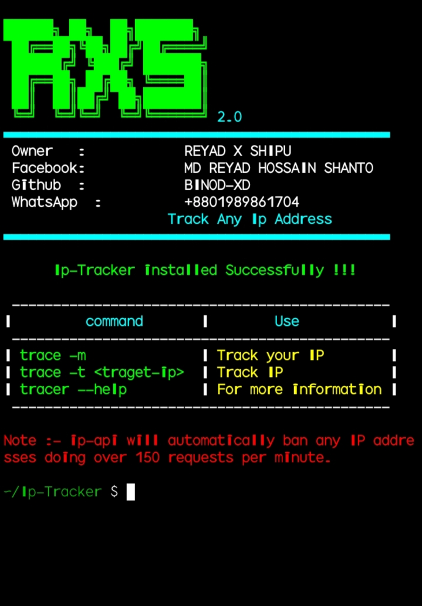
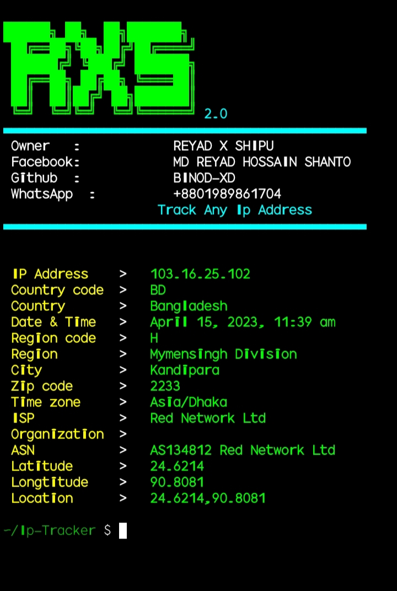

### What is Ip-Tracker ?

Ip-Tracker is used to track an ip address. Ip-Tracker is developed for Termux and Linux based systems. you can easily retrieve ip address information using Ip-Tracker. Ip-Tracker use ip-api to track ip address.

<p align="center">


</p>

### How to install  ?

```
apt update
```
```
apt install git -y
```
```
git clone --depth 1 https://github.com/BINOD-XD/Ip-Tracker
```
```
cd IP-Tracer
```
```
chmod +x install
```
```
sh install
```


### How to use IP-Tracer

* `To track your own ip address.`
```
trace -m
```
* `To track other's ip address for example ` `ip-tracer -t 127.0.0.1`
```
trace -t target-ip
```
* `For more information.`
```
trace
```

# Acknowledgements
## Special Thanks
* Reyad X Shipu
## [Facebook](https://www.facebook.com/reyadbross?mibextid=ZbWKwL)
## [Whatsapp](https://wa.me/+8801989861704)

## Thanks For Using This Tool 😘😍
